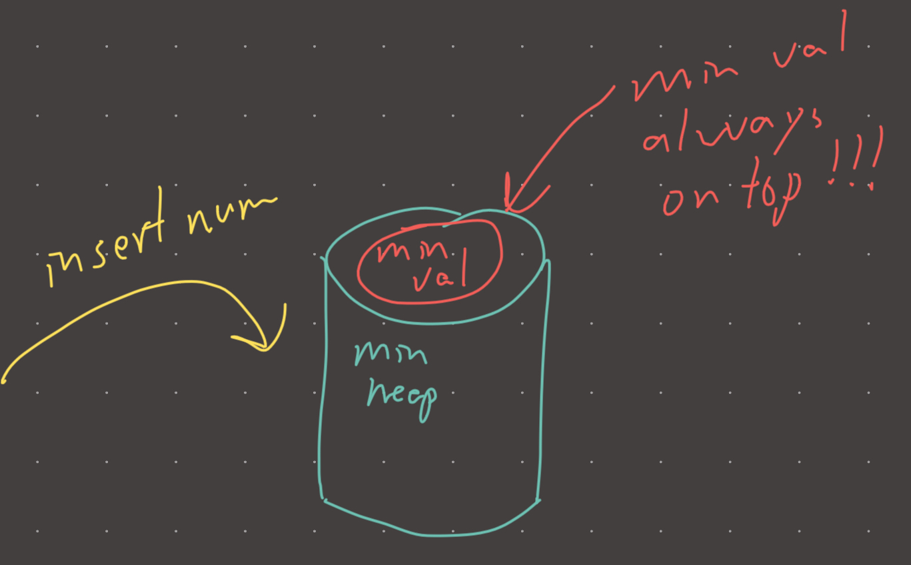

**DSA:** [sorted order](./sorted%20order.md), [subarray](./subarray.md)  
  
**Intuition**  
Heaps are incredibly useful for problems that have some kind of sorted property, and a subarray is usually the structure of interest.   
  
**Implementation**  
```python  
min_heap = []  
smallest_seen_at_every_index = []  
for num in nums:  
	heappush(heap, num)  
	smallest_seen_at_every_index.append(heap[0])  
return smallest_seen_at_every_index  
```  
  
**Visual**   
  
  
