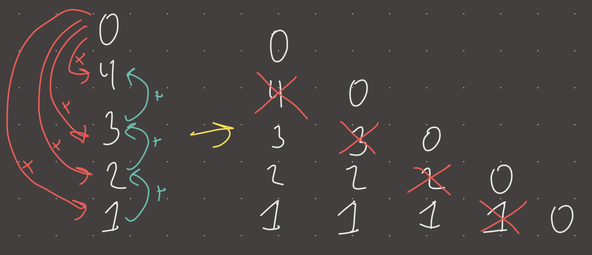

**DSA:** [stack](./stack.md), [subarray](./subarray.md)  
  
**Intuition**  
Always related to [subarray](./subarray.md) problems, typically counting the number of subarrays that meet some condition, or finding the next bigger/smaller. The basic intuition is that when you need to see future elements to decide something about the current element (does it meet some condition), AND the condition involves being the biggest or smallest, monotonic stack is used.  
  
**Implementation**  
```python  
def mono_stack(nums):  
	stack = []  
	for num in nums:  
		while stack and num < stack[-1]: #increasing, > for decreasing  
			stack.pop()  
		stack.append(num)  
```  
  
**Visual**   
  
  
  
