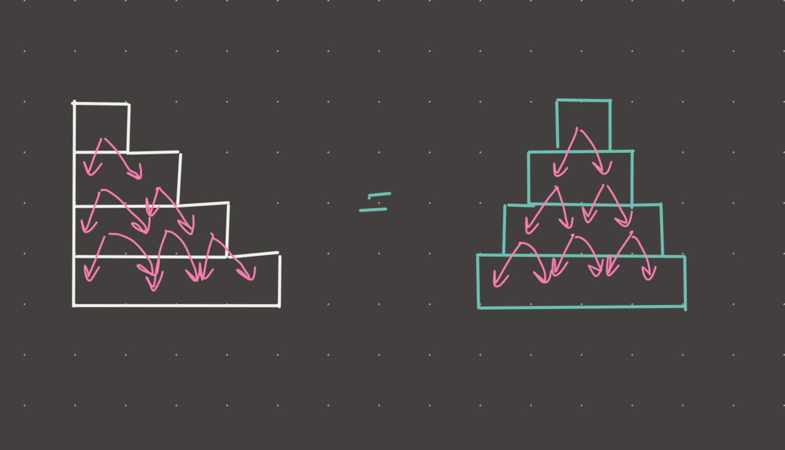

  
**Link:** https://leetcode.com/problems/champagne-tower/  
#### Solution:  
  
**Topics**: [simulation](simulation.md)  
  
**Intuition**  
The idea here is to create a model of this tower and pour the excess at each cup down a level (except at the final level), and then return the value at `tower[query_row][query_col]`. There are two edge cases to watch out for.   
  
1. The value in a cup can never go negative.  
2. The value in a cup can never be greater than one.  
  
Note that this is NOT a tree, its the diagonal of a matrix...levels don't double, they increment by one. Similar to the matrix traversal we do for transposing (see [Rotate image](./Rotate%20image.md))  
  
**Implementation**  
```python  
def champ_tower(poured, query_row, query_glass):  
	tower = [[0]*(i+1) for i in range(query_row+1)]  
	tower[0][0] = poured  
  
	for level in range(len(tower)-1):  
		for pos in range(len(tower[level])):  
			overflow = (tower[level][pos] - 1) / 2   
			if overflow > 0:  
				tower[level+1][pos] += overflow  
				tower[level+1][pos+1] += overflow  
	return min(tower[query_row][query_glass], 1)  
  
#time: o(n**2) n is the number of levels to the champagne tower   
#memory: o(n**2)  
```  
  
**Visual**   
  
  
#review   
  
  
