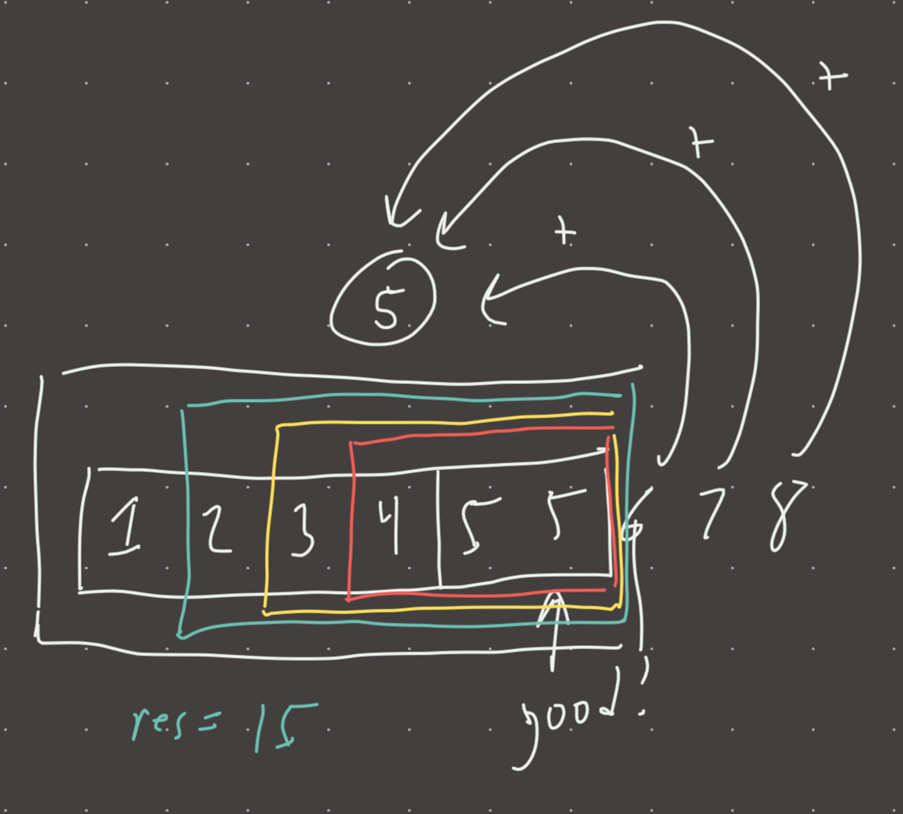

  
**Link:** https://leetcode.com/problems/count-the-number-of-good-subarrays/  
#### Solution:  
  
**DSA:** [sliding window](../DSA/sliding%20window.md), [hash map](../DSA/hash%20map.md), [subarray](../DSA/subarray.md)  
  
**Intuition**  
The problem is kind of tricky, but really what it's asking is for the number of pairs of duplicates in the subarray.   
  
Lets say we have a frequency map of the numbers so far and we have reached the number 2. It just so happens that the number 2 was already seen 3 times. This means that that the 2 that we are seeing creates 3 more pairs with the ones that have been seen previously (one for each).  
  
So as we iterate forwards through the list, we keep a frequency map and if the number has been seen previously, we add `freq[current]` to the number of pairs for the window.   
  
While `curr_pairs` is greater or equal to K, run a while loop to shrink the window until `curr_pairs` is smaller than K. Now we add the value of the left pointer (L) to the result. Why?  
  
For example take:  
`[1,2,3,4,5,5]` and K = 1  
  
1. we see that the only pair is `[5,5]` but our sliding window, would be L=0 and R=5 when K = 1  
2. but we must also count every subarray that can be MADE with `[5,5]`!  
3. namely `[4,5,5]`, `[3,4,5,5]`, `[2,3,4,5,5]`, and `[1,2,3,4,5,5]`!  
4. the convenient way to do this is just add L to the result after sliding the window over until `curr_pairs < k` . After doing this, our window ends up at L=5, R=5, so we add 5.  
5. This represents all subarrays that can be made with all elements up until the leftmost.  
6. The answer is indeed 5: `[5,5]`, `[4,5,5]`, `[3,4,5,5]`, `[2,3,4,5,5]`, and `[1,2,3,4,5,5]`!  
  
There is one notable "mind-fuck". If we do `r += l` after the while loop, wouldn't we be adding to the result at every iteration? Yes. Why?  
  
For example, what if we had:  
`[1,2,3,4,5,5,6]` and K = 1  
  
1. We see that like the previous problem, we have one pair, but the complication is that we have a 6 at the end which con forms 5 more good subarray : `[5,5,6]`, `[4,5,5,6]`, `[3,4,5,5,6]`, `[2,3,4,5,5,6]`, and `[1,2,3,4,5,5,6]`  
2. We can see that it formed precisely 5 more, so adding L again on 6 actually works.  
3. Think of L as a RESERVOIR for for the good subarrays up until that point, and each element in the future adds everything in the reservoir to the result.  
  
  
**Implementation**  
```python  
def countGood(self, A: List[int], k: int) -> int:  
	res = 0  
	counts = {}  
	l = 0  
	current_pairs = 0  
	for r in range(len(A)):  
		if A[r] in counts:  
		current_pairs += counts[A[r]]  
		counts[A[r]] = counts.get(A[r], 0) + 1  
		while current_pairs >= k:  
			counts[A[l]] -= 1  
			current_pairs -= counts[A[l]]  
			l += 1  
		res += l  
	return res  
```  
  
  
**Visual**   
  
  
  
#review 