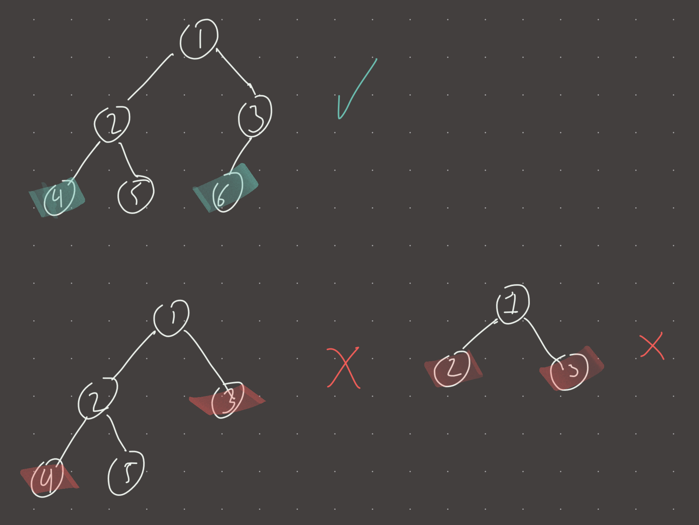

  
**Link:** https://leetcode.com/problems/cousins-in-binary-tree/editorial/  
#### Solution:  
  
**Topics**: [BFS](../DSA/BFS.md), [DFS](DFS.md), [tree](../DSA/tree.md)  
  
**Intuition**  
Pretty simple problem with either BFS approach or DFS. BFS is actually the most efficient because we can use early stopping. What that means is if we found either X at a certain level and not Y, then we can simply return false. To do this, we need level order traversal.  
  
**Implementation**  
```python  
def is_cousins(root, x, y):  
	found_parent = None  
	found_level = float('inf')  
	queue = deque([(root, None, 0)])  
	while queue:  
		node, parent, level = queue.popleft()  
		if level > found_level:  
			return False  
		if node.val == x or node.val == y:  
			if found_parent:  
				return found_parent != parent  
			found_parent = parent  
			found_level = level  
  
		if node.left:  
			queue.append((node.left, node, level+1))  
		if node.right:  
			queue.append((node.right, node, level+1))  
	return False  
		  
#time: o(n)  
#memory: o(n)  
```  
  
**Visual**   
  
  
  
  
#review   
  
  
