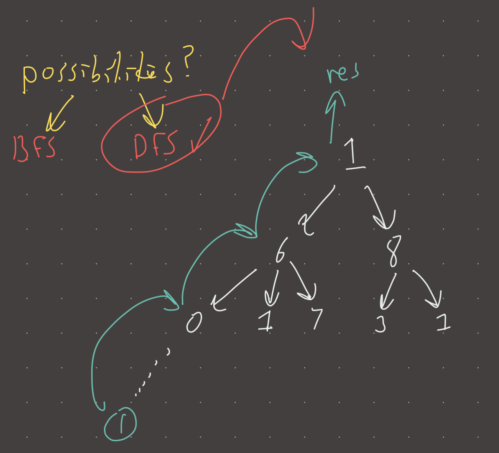

  
**Link:** https://leetcode.com/problems/knight-dialer  
#### Solution:  
  
**DSA**: [DP](DP.md)  
  
**Intuition**  
This is kind of a graph problem. Just do DFS with a cache for all possibilities and return 1 as the base case when length == n.  
  
There is also a crazy math solution that I don't really understand. Maybe memorize it if possible.   
  
**Implementation**  
```python  
def knight_dialer(n):  
	moves = {  
		1: [6,8],  
		2: [9,7],  
		3: [8,4],  
		4: [3,9,0],  
		5: [],  
		6: [0,1,7],  
		7: [6,2],  
		8: [3,1],  
		9: [2, 4],  
		0: [6, 4]  
	}  
	@cache  
	def dfs(prev, length):  
		if length == n:  
			return 1  
		res = 0  
		for move in moves[prev]:  
			res += dfs(move, length +  1)  
		return res  
		  
	res = 0  
	for start_move in moves:  
		res += dfs(start_move, 1)  
	return res % (10**9 + 7)  
		  
```  
  
```python  
#this is the crazy math solution. The intuition revolves around treating numbers as groups group-to-group jump options are the same regardles of which number you start from in the group. I dont understand this but its worth to look a on a third revision  
  
def knightDialer(self, n: int) -> int:  
	if n == 1:  
		return 10  
	A = 4  
	B = 2  
	C = 2  
	D = 1  
	MOD = 10 ** 9 + 7  
	for _ in range(n - 1):  
		A, B, C, D = (2 * (B + C)) % MOD, A, (A + 2 * D) % MOD, C  
	return (A + B + C + D) % MOD  
```  
This is the diagram from LC editorial:   
  
  
**Visual**   
  
  
**Memory encoding**  
  
#review   
  
  
