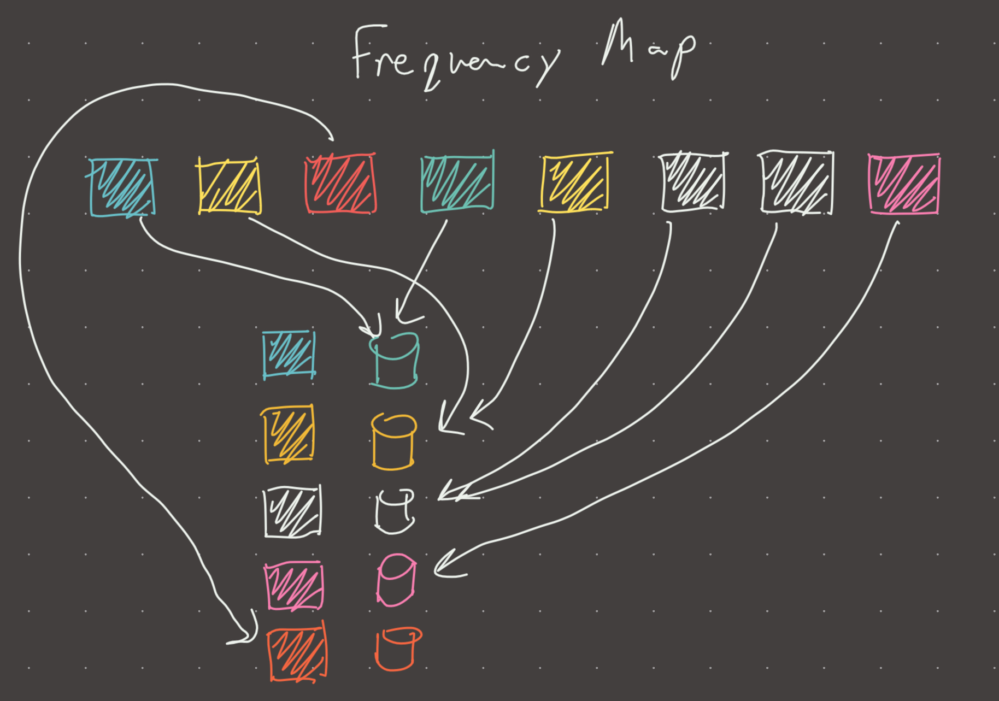

  
**Link:** https://leetcode.com/problems/minimum-number-of-operations-to-make-array-empty/  
#### Solution:  
  
**DSA**: [hash map](../DSA/hash%20map.md)  
  
**Intuition**  
Since we are permitted to remove two or three duplicate elements from any indices, frequency map comes to mind. Notice that a unique element can never be removed because the rules only allow removal by 2's and 3's...this would mean that its not possible to make the array empty and we return -1.   
  
As long as the count is greater than 1, it can be made empty with a combination of 2 deletions and 3 deletions. We are concerned with the minimum though, which means that we must use the 3 deletion rule as many times as possible. How?  
  
Lets say we have So lets say we have 7 `3's`, the optimal number of deletions is 3. First delete 3 `3's`, then delete 2 `3's` and then 2 `3's` again. The idea is to greedily use 3 deletions, and if we are left with 1, then we a deletion, because we replace the last 3 deletion with a 2 deletion.  
  
For example:  
```  
[3, 3, 3, 3, 3, 3, 3] no deletions  
[3, 3, 3, 3] three deletion  
[3] three deletion...one remains so we add a deletion.   
  
why? because conceptually, adding the deletion is the same as using 2 two deletions instead of 1 three deletion.  
  
[3, 3, 3, 3, 3, 3, 3] no deletions  
[3, 3, 3, 3] three deletion  
[3, 3] two deletion  
[] two deletion  
  
```  
  
Of course, since we only have a count we can perform this process mathematically with a simple trick.   
  
```python  
deletions = ceil(count/3)  
  
#this works because rounding up always give us the extra deletion in the event that there is a remainder  
```  
  
**Implementation**  
```python  
def min_operations(nums):  
	res = 0  
	freq = {}  
	for num in nums:  
		freq[num] = freq.get(num, 0) + 1  
	for count in freq.values():  
		if count == 1:  
			return -1  
		res += ceil(count/3)  
	return res  
```  
  
**Visual**   
  
  
  
  
#review   
  
  
