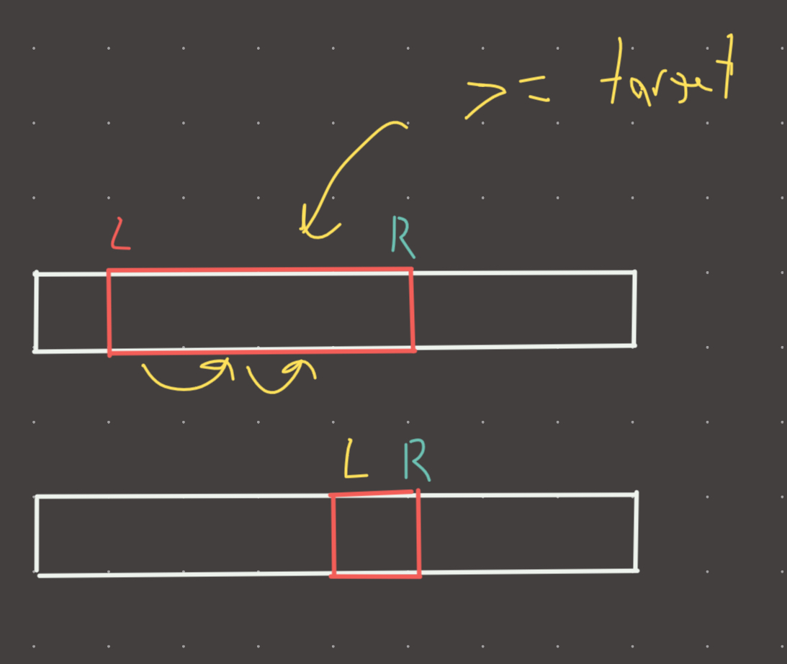

  
**Link:** https://leetcode.com/problems/minimum-size-subarray-sum/  
#### Solution:  
  
**Topics**: [sliding window](../DSA/sliding%20window.md), [binary search](binary%20search.md)  
  
**Intuition**  
Straight forward problem. Use a sliding window to shrink the window and take the min window that satisfies the constraint.   
  
The problem statement asks for an `nlogn` solution as well, kind of tricky to come up with but the idea is that the the possible answer has a lower bound and upper bound...specifically a subarray of length 1 as the lower bound and a subarray of `len(nums)` as the upper bound. If there exists a subarray of length k that satisfies the sum, then there is guaranteed to exist a subarray of length k+1 that also satisfies the constraint.  
  
**Implementation**  
```python  
def min_subarray(nums, target):  
	res = float('inf')  
	curr_sum = 0  
	l = 0  
	for r in range(len(nums)):  
		curr_sum += nums[r]  
		while curr_sum >= target:  
			res = min(res, r-l+1)  
			curr_sum -= nums[l]  
			l += 1  
	return res if res != float('inf') else 0  
  
#time: o(n)  
#memory: o(1)  
```  
  
**Implementation (binary search)**  
```python  
def min_subarray(nums, target):  
	def has_sum(k):  
		curr_sum = sum(nums[:k-1])  
		l = 0  
		for r in range(len(nums)):  
			curr_sum += nums[r]  
			if curr_sum >= target:  
				return True  
			curr_sum -= nums[l]  
			l += 1  
		return False  
  
	res = 0  
	l = 1  
	r = len(nums)  
	while l <= r:  
		mid = (l + r) // 2  
		if has_sum(mid):  
			res = mid  
			r = mid - 1  
		else:  
			l = mid + 1  
	return res  
```  
  
**Visual**   
  
  
#review   
  
  
