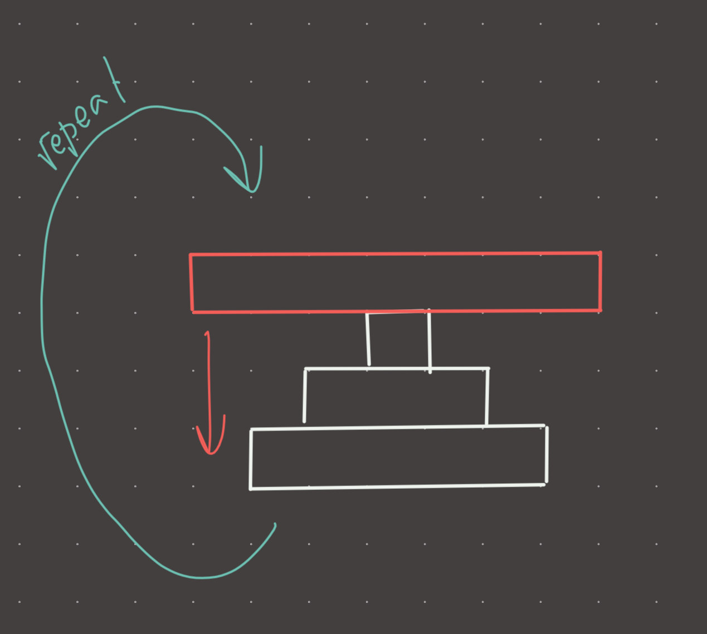

  
**Link:** https://leetcode.com/problems/next-greater-element-ii/  
#### Solution:  
  
**Topics**: [monotonic stack](../DSA/monotonic%20stack.md)  
  
**Intuition**  
Anything problem statement with "next greater" or "next smaller" should immediately bring to mind monotonic stack. In this case, next greater indicates that a decreasing stack must be used. The element that pops other elements off the stack, becomes the next greater for the popped element.  
  
There is a minor twist to the problem which is the "circular" requirement. The solution is just to pass over the elements twice all the while holding onto the same stack... and we only add elements to the stack that don't yet have a next greater. The last part is not strictly required but it makes the stack a bit more memory efficient.   
  
A very pretty implementation here is to iterate to `len(num)*2` instead of two explicit loops, and use the modulus operator to wrap back to the original index.  
  
**Implementation**  
```python  
def next_greater2(nums):  
	res = [-1]*len(nums)  
	stack = []  
	for i in range(len(nums)*2):  
		index = i % len(nums)  
		num = nums[index]  
		while stack and stack[-1][0] < num:  
			_, popped_i = stack.pop()  
			res[popped_i] = num  
		if res[index] == -1:  
			stack.append((num, index))  
	return res  
			  
  
#time: o(n)  
#memory: o(n)  
```  
  
**Visual**   
  
  
  
#review   
  
  
