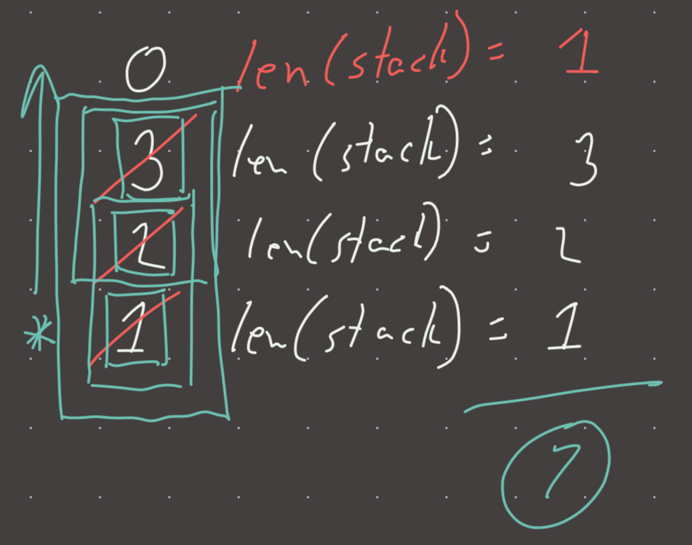

**Link:** https://leetcode.com/problems/number-of-valid-subarrays/  
#### Solution:  
  
**DSA:** [monotonic stack](../DSA/monotonic%20stack.md), [subarray](../DSA/subarray.md)  
  
**Intuition**  
Tricky problem, but the solution is quite simple with a monotonically increasing stack. If we keep a monotonically increasing stack, the length of that stack at every iteration is exactly how many valid subarrays can be formed. Somewhat similar to [Count the number of good subarrays](./Count%20the%20number%20of%20good%20subarrays.md), in terms of using a RESERVOIR, but here our reservoir is the length of the stack!  
  
Why is this the case? Because consider the array `[1, 2, 3, 0]`. After adding 1 to the stack our stack is `[1]`. The stack is monotonic, so we add 1 to our result which corresponds to the subarray `[1]`.   
  
Next we add 2 and get `[1, 2]`, the stack is still monotonic so we add 2 to the result which corresponds to the subarrays `[1, 2] and [2]`.   
  
Next we add 3 and get `[1, 2, 3]`, the stack is still monotonic so so so we add the 3 to the result (length of the stack) which corresponds to the subarrays `[3], [2, 3] and [1, 2, 3]`.  
  
Next we add 0 and get a stack of `[0]` because 0 pops off everything that is greater than it to retain the monotonically increasing property. So now we add 1 to the result because the length of the stack is now 1 which corresponds to the subarray `[1]`  
  
The key to this problem is understanding that every element that we add to the stack can form another valid subarray with every element that already exists on the stack (including itself).   
  
**Implementation**  
```python  
def valid_subarrays(nums):  
	res = 0  
	stack = []  
	for num in nums:  
		while stack and stack[-1] > num:  
			stack.pop()  
		stack.append(num)  
		res += len(stack)  
	return res  
  
```  
  
**Visual**   
  
  
  
#review 