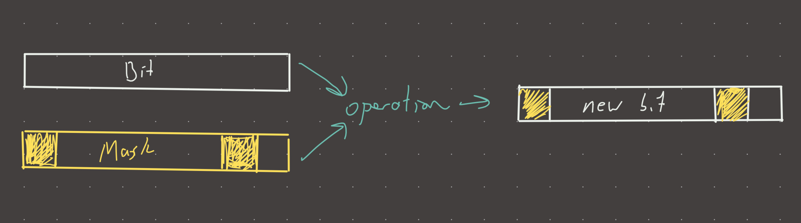

  
**Link:** https://leetcode.com/problems/power-of-two/  
#### Solution:  
  
**Topics**: [bitwise](bitwise.md), [Pseudo palindromic paths in a binary tree](./Pseudo%20palindromic%20paths%20in%20a%20binary%20tree.md)  
  
**Intuition**  
This is a bitwise problem using the `&` operator, see [Pseudo palindromic paths in a binary tree](./Pseudo%20palindromic%20paths%20in%20a%20binary%20tree.md) for a detailed explanation on it  
  
**Implementation**  
```python  
def is_power(n):  
	if n == 0:  
		return False  
	return n & (-n) == n  
  
#time: o(1)  
#memory: o(1)  
```  
  
**Visual**   
  
  
#review   
  
  
