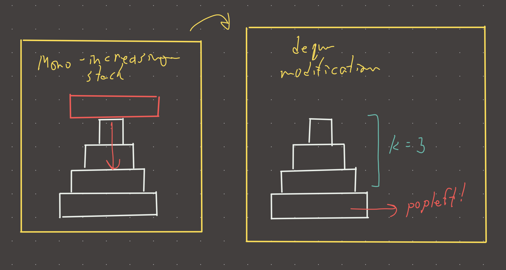

  
**Link:** https://leetcode.com/problems/sliding-window-maximum/  
#### Solution:  
  
**Topics**: [stack](../DSA/stack.md), [deque](deque.md), [sliding window](../DSA/sliding%20window.md)  
  
**Intuition**  
Kind of tricky problem, my first intuition was to use a heap which actually works very well but the efficiency is a little bit worse than optimal (although still good). The most optimal solution is pretty clever. We use a monotonically increasing stack and just pop off the left side to keep all the values in the window.   
  
Overall, its not that hard to come up with, but the optimal solution was not the first thing that came to my mind.   
  
**Implementation**  
```python  
def win_max(nums, k):  
	stack = deque()  
	res = []  
	for i in range(len(nums)):  
		while stack and stack[-1][0] <= nums[i]:  
			stack.pop()  
		stack.append((nums[i], i))  
		if stack[0][1] < i-k+1:  
			stack.popleft()  
		if i >= k-1:  
			res.append(stack[0][0])  
	return res  
#time: o(n)  
#memory: o(k)  
```  
  
**Visual**   
  
  
#review   
  
